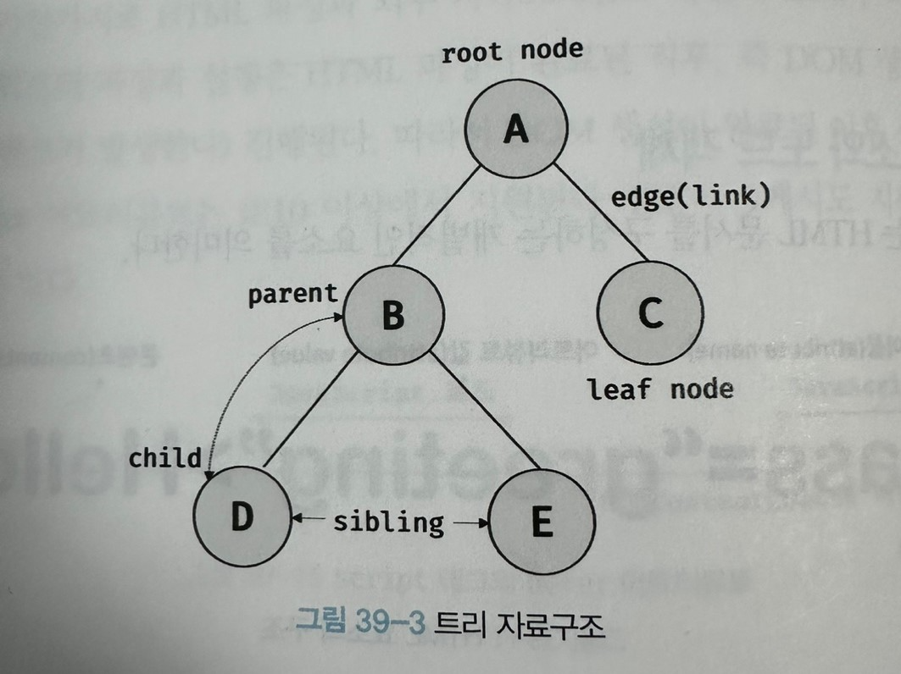

# DOM
DOM은 HTML 문서의 계층적 구조와 정보를 표현하며 이를 제어할 수 있는 API 즉 프로퍼티와 메서드를 제공하는 트리 자료구조다


HTMl 문서를 구성하는 개별적인 요소의 의미이다.


# 39-01

```html
<!DOCTYPE html>
<html>
  <head>
    <meta charset="UTF-8">
    <link rel="stylesheet" href="style.css">
  </head>
  <body>
    <ul>
      <li id="apple">Apple</li>
      <li id="banana">Banana</li>
      <li id="orange">Orange</li>
    </ul>
    <script src="app.js"></script>
  </body>
</html>
```


# 39-02

```html
<!DOCTYPE html>
<html>
<body>
  <input type="text">
  <script>
    // input 요소 노드 객체를 선택
    const $input = document.querySelector('input');

    // input 요소 노드 객체의 프로토타입 체인
    console.log(
      Object.getPrototypeOf($input) === HTMLInputElement.prototype,
      Object.getPrototypeOf(HTMLInputElement.prototype) === HTMLElement.prototype,
      Object.getPrototypeOf(HTMLElement.prototype) === Element.prototype,
      Object.getPrototypeOf(Element.prototype) === Node.prototype,
      Object.getPrototypeOf(Node.prototype) === EventTarget.prototype,
      Object.getPrototypeOf(EventTarget.prototype) === Object.prototype
    ); // 모두 true
  </script>
</body>
</html>
```


# 39-03

```html
<!DOCTYPE html>
<html>
  <body>
    <ul>
      <li id="apple">Apple</li>
      <li id="banana">Banana</li>
      <li id="orange">Orange</li>
    </ul>
    <script>
      // id 값이 'banana'인 요소 노드를 탐색하여 반환한다.
      // 두 번째 li 요소가 파싱되어 생성된 요소 노드가 반환된다.
      const $elem = document.getElementById('banana');

      // 취득한 요소 노드의 style.color 프로퍼티 값을 변경한다.
      $elem.style.color = 'red';
    </script>
  </body>
</html>
```

# 39-04

```html
<!DOCTYPE html>
<html>
  <body>
    <ul>
      <li id="banana">Apple</li>
      <li id="banana">Banana</li>
      <li id="banana">Orange</li>
    </ul>
    <script>
      // getElementById 메서드는 언제나 단 하나의 요소 노드를 반환한다.
      // 첫 번째 li 요소가 파싱되어 생성된 요소 노드가 반환된다.
      const $elem = document.getElementById('banana');

      // 취득한 요소 노드의 style.color 프로퍼티 값을 변경한다.
      $elem.style.color = 'red';
    </script>
  </body>
</html>
```

# 39-05

```html
<!DOCTYPE html>
<html>
  <body>
    <ul>
      <li id="apple">Apple</li>
      <li id="banana">Banana</li>
      <li id="orange">Orange</li>
    </ul>
    <script>
      // id 값이 'grape'인 요소 노드를 탐색하여 반환한다. null이 반환된다.
      const $elem = document.getElementById('grape');

      // 취득한 요소 노드의 style.color 프로퍼티 값을 변경한다.
      $elem.style.color = 'red';
      // -> TypeError: Cannot read property 'style' of null
    </script>
  </body>
</html>
```

# 39-06

```html
<!DOCTYPE html>
<html>
  <body>
    <div id="foo"></div>
    <script>
      // id 값과 동일한 이름의 전역 변수가 암묵적으로 선언되고 해당 노드 객체가 할당된다.
      console.log(foo === document.getElementById('foo')); // true

      // 암묵적 전역으로 생성된 전역 프로퍼티는 삭제되지만 전역 변수는 삭제되지 않는다.
      delete foo;
      console.log(foo); // <div id="foo"></div>
    </script>
  </body>
</html>
```

# 39-07

```html
<!DOCTYPE html>
<html>
  <body>
    <div id="foo"></div>
    <script>
      let foo = 1;

      // id 값과 동일한 이름의 전역 변수가 이미 선언되어 있으면 노드 객체가 재할당되지 않는다.
      console.log(foo); // 1
    </script>
  </body>
</html>
```

# 39-08

```html
<!DOCTYPE html>
<html>
  <body>
    <ul>
      <li id="apple">Apple</li>
      <li id="banana">Banana</li>
      <li id="orange">Orange</li>
    </ul>
    <script>
      // 태그 이름이 li인 요소 노드를 모두 탐색하여 반환한다.
      // 탐색된 요소 노드들은 HTMLCollection 객체에 담겨 반환된다.
      // HTMLCollection 객체는 유사 배열 객체이면서 이터러블이다.
      const $elems = document.getElementsByTagName('li');

      // 취득한 모든 요소 노드의 style.color 프로퍼티 값을 변경한다.
      // HTMLCollection 객체를 배열로 변환하여 순회하며 color 프로퍼티 값을 변경한다.
      [...$elems].forEach(elem => { elem.style.color = 'red'; });
    </script>
  </body>
</html>
```

# 39-09

```javascript
// 모든 요소 노드를 탐색하여 반환한다.
const $all = document.getElementsByTagName('*');
// -> HTMLCollection(8) [html, head, body, ul, li#apple, li#banana, li#orange, script, apple: li#apple, banana: li#banana, orange: li#orange]
```

# 39-10

```html
<!DOCTYPE html>
<html>
  <body>
    <ul id="fruits">
      <li>Apple</li>
      <li>Banana</li>
      <li>Orange</li>
    </ul>
    <ul>
      <li>HTML</li>
    </ul>
    <script>
      // DOM 전체에서 태그 이름이 li인 요소 노드를 모두 탐색하여 반환한다.
      const $lisFromDocument = document.getElementsByTagName('li');
      console.log($lisFromDocument); // HTMLCollection(4) [li, li, li, li]

      // #fruits 요소의 자손 노드 중에서 태그 이름이 li인 요소 노드를 모두
      // 탐색하여 반환한다.
      const $fruits = document.getElementById('fruits');
      const $lisFromFruits = $fruits.getElementsByTagName('li');
      console.log($lisFromFruits); // HTMLCollection(3) [li, li, li]
    </script>
  </body>
</html>
```

# 39-11

```html
<!DOCTYPE html>
<html>
  <body>
    <ul>
      <li class="fruit apple">Apple</li>
      <li class="fruit banana">Banana</li>
      <li class="fruit orange">Orange</li>
    </ul>
    <script>
      // class 값이 'fruit'인 요소 노드를 모두 탐색하여 HTMLCollection 객체에 담아 반환한다.
      const $elems = document.getElementsByClassName('fruit');

      // 취득한 모든 요소의 CSS color 프로퍼티 값을 변경한다.
      [...$elems].forEach(elem => { elem.style.color = 'red'; });

      // class 값이 'fruit apple'인 요소 노드를 모두 탐색하여 HTMLCollection 객체에 담아 반환한다.
      const $apples = document.getElementsByClassName('fruit apple');

      // 취득한 모든 요소 노드의 style.color 프로퍼티 값을 변경한다.
      [...$apples].forEach(elem => { elem.style.color = 'blue'; });
    </script>
  </body>
</html>
```

# 39-12

```html
<!DOCTYPE html>
<html>
  <body>
    <ul id="fruits">
      <li class="apple">Apple</li>
      <li class="banana">Banana</li>
      <li class="orange">Orange</li>
    </ul>
    <div class="banana">Banana</div>
    <script>
      // DOM 전체에서 class 값이 'banana'인 요소 노드를 모두 탐색하여 반환한다.
      const $bananasFromDocument = document.getElementsByClassName('banana');
      console.log($bananasFromDocument); // HTMLCollection(2) [li.banana, div.banana]

      // #fruits 요소의 자손 노드 중에서 class 값이 'banana'인 요소 노드를 모두 탐색하여 반환한다.
      const $fruits = document.getElementById('fruits');
      const $bananasFromFruits = $fruits.getElementsByClassName('banana');

      console.log($bananasFromFruits); // HTMLCollection [li.banana]
    </script>
  </body>
</html>
```

# 39-13

```css
/* 전체 선택자: 모든 요소를 선택 */
* { ... }
/* 태그 선택자: 모든 p 태그 요소를 모두 선택 */
p { ... }
/* id 선택자: id 값이 'foo'인 요소를 모두 선택 */
#foo { ... }
/* class 선택자: class 값이 'foo'인 요소를 모두 선택 */
.foo { ... }
/* 어트리뷰트 선택자: input 요소 중에 type 어트리뷰트 값이 'text'인 요소를 모두 선택 */
input[type=text] { ... }
/* 후손 선택자: div 요소의 후손 요소 중 p 요소를 모두 선택 */
div p { ... }
/* 자식 선택자: div 요소의 자식 요소 중 p 요소를 모두 선택 */
div > p { ... }
/* 인접 형제 선택자: p 요소의 형제 요소 중에 p 요소 바로 뒤에 위치하는 ul 요소를 선택 */
p + ul { ... }
/* 일반 형제 선택자: p 요소의 형제 요소 중에 p 요소 뒤에 위치하는 ul 요소를 모두 선택 */
p ~ ul { ... }
/* 가상 클래스 선택자: hover 상태인 a 요소를 모두 선택 */
a:hover { ... }
/* 가상 요소 선택자: p 요소의 콘텐츠의 앞에 위치하는 공간을 선택
   일반적으로 content 프로퍼티와 함께 사용된다. */
p::before { ... }
```

# 39-14

```html
<!DOCTYPE html>
<html>
  <body>
    <ul>
      <li class="apple">Apple</li>
      <li class="banana">Banana</li>
      <li class="orange">Orange</li>
    </ul>
    <script>
      // class 어트리뷰트 값이 'banana'인 첫 번째 요소 노드를 탐색하여 반환한다.
      const $elem = document.querySelector('.banana');

      // 취득한 요소 노드의 style.color 프로퍼티 값을 변경한다.
      $elem.style.color = 'red';
    </script>
  </body>
</html>
```
<div class="result"></div>

# 39-15

```html
<!DOCTYPE html>
<html>
  <body>
    <ul>
      <li class="apple">Apple</li>
      <li class="banana">Banana</li>
      <li class="orange">Orange</li>
    </ul>
    <script>
      // ul 요소의 자식 요소인 li 요소를 모두 탐색하여 반환한다.
      const $elems = document.querySelectorAll('ul > li');
      // 취득한 요소 노드들은 NodeList 객체에 담겨 반환된다.
      console.log($elems); // NodeList(3) [li.apple, li.banana, li.orange]

      // 취득한 모든 요소 노드의 style.color 프로퍼티 값을 변경한다.
      // NodeList는 forEach 메서드를 제공한다.
      $elems.forEach(elem => { elem.style.color = 'red'; });
    </script>
  </body>
</html>
```

# 39-16

```javascript
// 모든 요소 노드를 탐색하여 반환한다.
const $all = document.querySelectorAll('*');
// -> NodeList(8) [html, head, body, ul, li#apple, li#banana, li#orange, script]
```

# 39-17

```html
<!DOCTYPE html>
<html>
  <body>
    <ul id="fruits">
      <li class="apple">Apple</li>
      <li class="banana">Banana</li>
      <li class="orange">Orange</li>
    </ul>
  </body>
  <script>
    const $apple = document.querySelector('.apple');

    // $apple 노드는 '#fruits > li.apple'로 취득할 수 있다.
    console.log($apple.matches('#fruits > li.apple'));  // true

    // $apple 노드는 '#fruits > li.banana'로 취득할 수 없다.
    console.log($apple.matches('#fruits > li.banana')); // false
  </script>
</html>
```

# 39-18

```html
<!DOCTYPE html>
<head>
  <style>
    .red { color: red; }
    .blue { color: blue; }
  </style>
</head>
<html>
  <body>
    <ul id="fruits">
      <li class="red">Apple</li>
      <li class="red">Banana</li>
      <li class="red">Orange</li>
    </ul>
    <script>
      // class 값이 'red'인 요소 노드를 모두 탐색하여 HTMLCollection 객체에 담아 반환한다.
      const $elems = document.getElementsByClassName('red');
      // 이 시점에 HTMLCollection 객체에는 3개의 요소 노드가 담겨 있다.
      console.log($elems); // HTMLCollection(3) [li.red, li.red, li.red]

      // HTMLCollection 객체의 모든 요소의 class 값을 'blue'로 변경한다.
      for (let i = 0; i < $elems.length; i++) {
        $elems[i].className = 'blue';
      }

      // HTMLCollection 객체의 요소가 3개에서 1개로 변경되었다.
      console.log($elems); // HTMLCollection(1) [li.red]
    </script>
  </body>
</html>
```

# 39-19

```javascript
// for 문을 역방향으로 순회
for (let i = $elems.length - 1; i >= 0; i--) {
  $elems[i].className = 'blue';
}
```

# 39-20

```javascript
// while 문으로 HTMLCollection에 요소가 남아 있지 않을 때까지 무한 반복
let i = 0;
while ($elems.length > i) {
  $elems[i].className = 'blue';
}
```

# 39-21

```javascript
// 유사 배열 객체이면서 이터러블인 HTMLCollection을 배열로 변환하여 순회
[...$elems].forEach(elem => elem.className = 'blue');
```

# 39-22

```javascript
// querySelectorAll은 DOM 컬렉션 객체인 NodeList를 반환한다.
const $elems = document.querySelectorAll('.red');

// NodeList 객체는 NodeList.prototype.forEach 메서드를 상속받아 사용할 수 있다.
$elems.forEach(elem => elem.className = 'blue');
```

# 39-23

```html
<!DOCTYPE html>
<html>
  <body>
    <ul id="fruits">
      <li>Apple</li>
      <li>Banana</li>
    </ul>
  </body>
  <script>
    const $fruits = document.getElementById('fruits');

    // childNodes 프로퍼티는 NodeList 객체(live)를 반환한다.
    const { childNodes } = $fruits;
    console.log(childNodes instanceof NodeList); // true

    // $fruits 요소의 자식 노드는 공백 텍스트 노드(39.3.1절 "공백 텍스트 노드" 참고)를 포함해 모두 5개다.
    console.log(childNodes); // NodeList(5) [text, li, text, li, text]

    for (let i = 0; i < childNodes.length; i++) {
      // removeChild 메서드는 $fruits 요소의 자식 노드를 DOM에서 삭제한다.
      // (39.6.9절 "노드 삭제" 참고)
      // removeChild 메서드가 호출될 때마다 NodeList 객체인 childNodes가 실시간으로 변경된다.
      // 따라서 첫 번째, 세 번째 다섯 번째 요소만 삭제된다.
      $fruits.removeChild(childNodes[i]);
    }

    // 예상과 다르게 $fruits 요소의 모든 자식 노드가 삭제되지 않는다.
    console.log(childNodes); // NodeList(2) [li, li]
  </script>
</html>
```

# 39-24

```html
<!DOCTYPE html>
<html>
  <body>
    <ul id="fruits">
      <li>Apple</li>
      <li>Banana</li>
    </ul>
  </body>
  <script>
    const $fruits = document.getElementById('fruits');

    // childNodes 프로퍼티는 NodeList 객체(live)를 반환한다.
    const { childNodes } = $fruits;

    // 스프레드 문법을 사용하여 NodeList 객체를 배열로 변환한다.
    [...childNodes].forEach(childNode => {
      $fruits.removeChild(childNode);
    });

    // $fruits 요소의 모든 자식 노드가 모두 삭제되었다.
    console.log(childNodes); // NodeList []
  </script>
</html>
```

# 39-25

```html
<ul id="fruits">
  <li class="apple">Apple</li>
  <li class="banana">Banana</li>
  <li class="orange">Orange</li>
</ul>
```


# 39-26

```html
<!DOCTYPE html>
<html>
  <body>
    <ul id="fruits">
      <li class="apple">Apple</li>
      <li class="banana">Banana</li>
      <li class="orange">Orange</li>
    </ul>
  </body>
</html>
```


# 39-27

```html
<ul id="fruits"><li
  class="apple">Apple</li><li
  class="banana">Banana</li><li
  class="orange">Orange</li></ul>
```

# 39-28

```html
<!DOCTYPE html>
<html>
  <body>
    <ul id="fruits">
      <li class="apple">Apple</li>
      <li class="banana">Banana</li>
      <li class="orange">Orange</li>
    </ul>
  </body>
  <script>
    // 노드 탐색의 기점이 되는 #fruits 요소 노드를 취득한다.
    const $fruits = document.getElementById('fruits');

    // #fruits 요소의 모든 자식 노드를 탐색한다.
    // childNodes 프로퍼티가 반환한 NodeList에는 요소 노드뿐만 아니라 텍스트 노드도 포함되어 있다.
    console.log($fruits.childNodes);
    // NodeList(7) [text, li.apple, text, li.banana, text, li.orange, text]

    // #fruits 요소의 모든 자식 노드를 탐색한다.
    // children 프로퍼티가 반환한 HTMLCollection에는 요소 노드만 포함되어 있다.
    console.log($fruits.children);
    // HTMLCollection(3) [li.apple, li.banana, li.orange]

    // #fruits 요소의 첫 번째 자식 노드를 탐색한다.
    // firstChild 프로퍼티는 텍스트 노드를 반환할 수도 있다.
    console.log($fruits.firstChild); // #text

    // #fruits 요소의 마지막 자식 노드를 탐색한다.
    // lastChild 프로퍼티는 텍스트 노드를 반환할 수도 있다.
    console.log($fruits.lastChild); // #text

    // #fruits 요소의 첫 번째 자식 노드를 탐색한다.
    // firstElementChild 프로퍼티는 요소 노드만 반환한다.
    console.log($fruits.firstElementChild); // li.apple

    // #fruits 요소의 마지막 자식 노드를 탐색한다.
    // lastElementChild 프로퍼티는 요소 노드만 반환한다.
    console.log($fruits.lastElementChild); // li.orange
  </script>
</html>
```

# 39-29

```html
<!DOCTYPE html>
<html>
  <body>
    <ul id="fruits">
    </ul>
  </body>
  <script>
    // 노드 탐색의 기점이 되는 #fruits 요소 노드를 취득한다.
    const $fruits = document.getElementById('fruits');

    // #fruits 요소에 자식 노드가 존재하는지 확인한다.
    // hasChildNodes 메서드는 텍스트 노드를 포함하여 자식 노드의 존재를 확인한다.
    console.log($fruits.hasChildNodes()); // true
  </script>
</html>
```

# 39-30

```html
<!DOCTYPE html>
<html>
  <body>
    <ul id="fruits">
    </ul>
  </body>
  <script>
    // 노드 탐색의 기점이 되는 #fruits 요소 노드를 취득한다.
    const $fruits = document.getElementById('fruits');

    // hasChildNodes 메서드는 텍스트 노드를 포함하여 자식 노드의 존재를 확인한다.
    console.log($fruits.hasChildNodes()); // true

    // 자식 노드 중에 텍스트 노드가 아닌 요소 노드가 존재하는지는 확인한다.
    console.log(!!$fruits.children.length); // 0 -> false
    // 자식 노드 중에 텍스트 노드가 아닌 요소 노드가 존재하는지는 확인한다.
    console.log(!!$fruits.childElementCount); // 0 -> false
  </script>
</html>
```

# 39-31

```html
<!DOCTYPE html>
<html>
<body>
  <div id="foo">Hello</div>
  <script>
    // 요소 노드의 텍스트 노드는 firstChild 프로퍼티로 접근할 수 있다.
    console.log(document.getElementById('foo').firstChild); // #text
  </script>
</body>
</html>
```

# 39-32

```html
<!DOCTYPE html>
<html>
  <body>
    <ul id="fruits">
      <li class="apple">Apple</li>
      <li class="banana">Banana</li>
      <li class="orange">Orange</li>
    </ul>
  </body>
  <script>
    // 노드 탐색의 기점이 되는 .banana 요소 노드를 취득한다.
    const $banana = document.querySelector('.banana');

    // .banana 요소 노드의 부모 노드를 탐색한다.
    console.log($banana.parentNode); // ul#fruits
  </script>
</html>
```

# 39-33

```html
<!DOCTYPE html>
<html>
  <body>
    <ul id="fruits">
      <li class="apple">Apple</li>
      <li class="banana">Banana</li>
      <li class="orange">Orange</li>
    </ul>
  </body>
  <script>
    // 노드 탐색의 기점이 되는 #fruits 요소 노드를 취득한다.
    const $fruits = document.getElementById('fruits');

    // #fruits 요소의 첫 번째 자식 노드를 탐색한다.
    // firstChild 프로퍼티는 요소 노드뿐만 아니라 텍스트 노드를 반환할 수도 있다.
    const { firstChild } = $fruits;
    console.log(firstChild); // #text

    // #fruits 요소의 첫 번째 자식 노드(텍스트 노드)의 다음 형제 노드를 탐색한다.
    // nextSibling 프로퍼티는 요소 노드뿐만 아니라 텍스트 노드를 반환할 수도 있다.
    const { nextSibling } = firstChild;
    console.log(nextSibling); // li.apple

    // li.apple 요소의 이전 형제 노드를 탐색한다.
    // previousSibling 프로퍼티는 요소 노드뿐만 아니라 텍스트 노드를 반환할 수도 있다.
    const { previousSibling } = nextSibling;
    console.log(previousSibling); // #text

    // #fruits 요소의 첫 번째 자식 요소 노드를 탐색한다.
    // firstElementChild 프로퍼티는 요소 노드만 반환한다.
    const { firstElementChild } = $fruits;
    console.log(firstElementChild); // li.apple

    // #fruits 요소의 첫 번째 자식 요소 노드(li.apple)의 다음 형제 노드를 탐색한다.
    // nextElementSibling 프로퍼티는 요소 노드만 반환한다.
    const { nextElementSibling } = firstElementChild;
    console.log(nextElementSibling); // li.banana

    // li.banana 요소의 이전 형제 요소 노드를 탐색한다.
    // previousElementSibling 프로퍼티는 요소 노드만 반환한다.
    const { previousElementSibling } = nextElementSibling;
    console.log(previousElementSibling); // li.apple
  </script>
</html>
```
