> 브라우저는 처리해야 할 특정 사건이 발생하면 이를 감지하여 이벤트를 발생시킨다. 예를 들어,클릭,키보드 입력,마우스 이동 등이 일어나면 브라우저는 이를 감지하여 특정한 타입의 이벤트를 발생시킨다.

> 만약 애플리케이션이 특정 타입의 이벤트에 대해 반응하여 어떤 일을 하고 싶다면 해당하는 타입의 이벤트가 발생했을 때 호출될 함수를 브라우저에게 알려 호출을 위임한다. 이때 이벤트가 발생했을 때 호출될 함수를 **이벤트 핸들러** 라고 하고, 이벤트가 발생했을 때 브라우저에게 이벤트 핸들러의 호출을 위임하는 것을 이벤트 핸들러 등록이라 한다.

# 40-01

```html
<!DOCTYPE html>
<html>
<body>
  <button>Click me!</button>
  <script>
    const $button = document.querySelector('button');

    // 사용자가 버튼을 클릭하면 함수를 호출하도록 요청
    $button.onclick = () => { alert('button click'); };
  </script>
</body>
</html>
```
버튼 요소 $button의 onclick 프로퍼티에 함수를 할당했다. Window,Document,HTMLElement 타입의 객체는 onclick과 같이 특정 이벤트에 대응하는 다양한 이벤트 핸들러 프로퍼티를 가지고 있다. 이 이벤트 핸들러 프로퍼티에 함수를 할당하면 해당 이벤트가 발생했을 때 할당한 함수가 브라우저에 의해 호출된다.

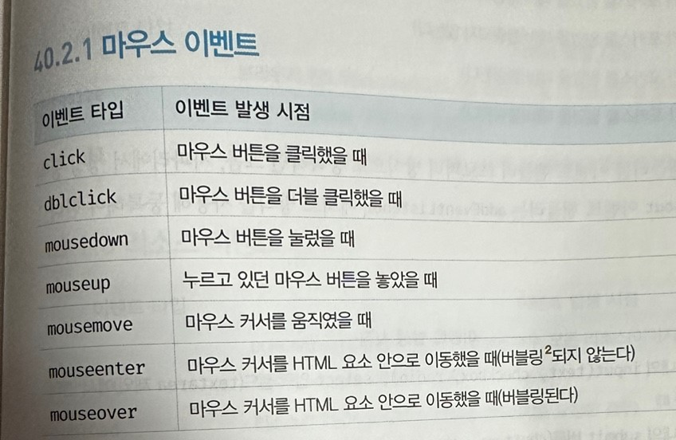
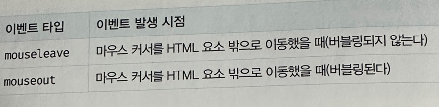

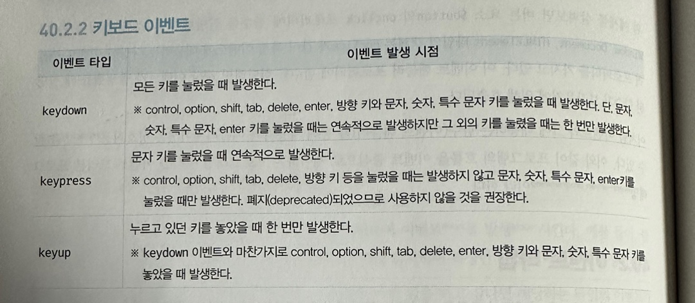
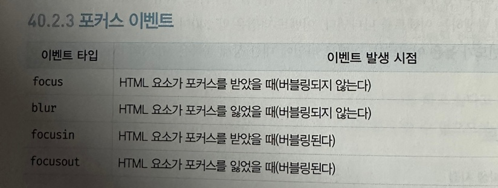

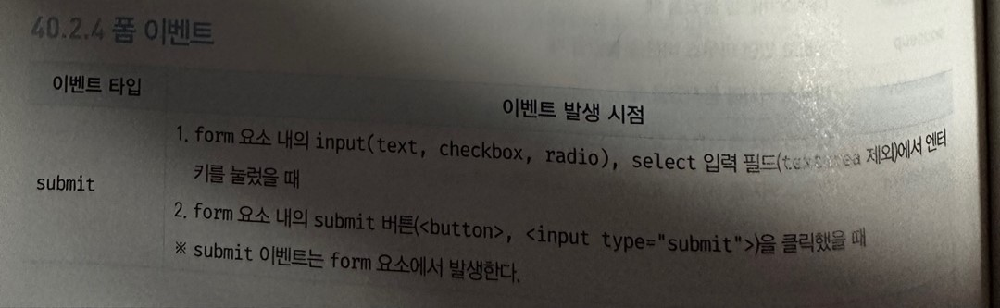
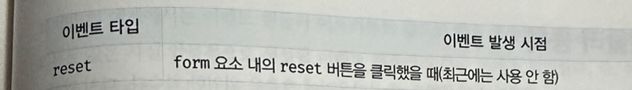

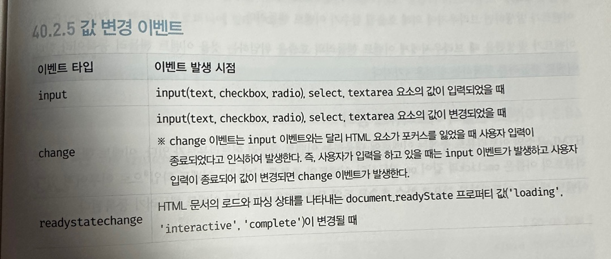

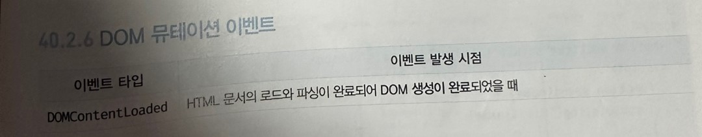

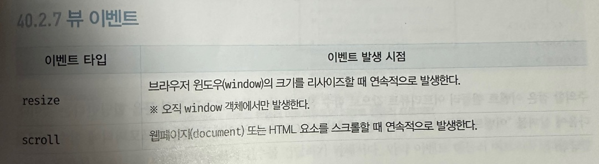

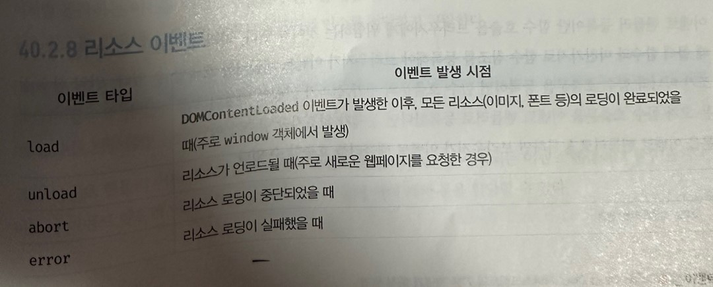
# 40.3.1 이벤트 핸들러 어트리뷰트 방식
HTML 요소의 어트리뷰트 중에는 이벤트에 대응하는 이벤트 핸들러 어트리뷰트가 있다. 이벤트 핸들러 어트리뷰트의 이름은 onclick과 같이 on 접두사와 이벤트의 종류를 나타내는 이벤트 타입으로 이루어져 있다. 이벤트 핸들러 어트리뷰트 값으로 함수 호출문 등의 문을 할당하면 이벤트 핸들러가 등록된다.
# 40-02

```html
<!DOCTYPE html>
<html>
<body>
  <button onclick="sayHi('Lee')">Click me!</button>
  <script>
    function sayHi(name) {
      console.log(`Hi! ${name}.`);
    }
  </script>
</body>
</html>
```

# 40-03

```javascript
function onclick(event) {
  sayHi('Lee');
}
```
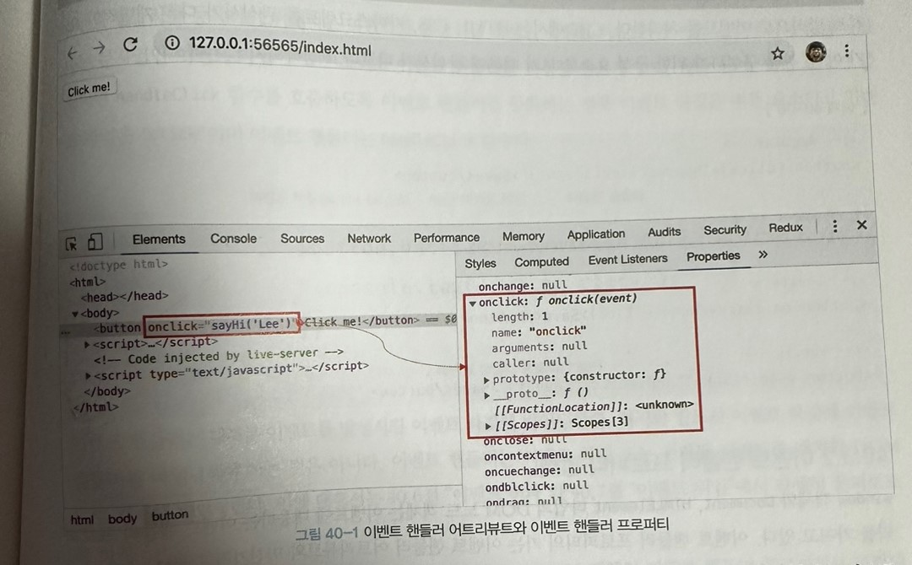
# 40-04

```html
<!-- 이벤트 핸들러에 인수를 전달하기 곤란하다. -->
<button onclick="sayHi">Click me!</button>
```

# 40-05

```html
<button onclick="console.log('Hi! '); console.log('Lee');">Click me!</button>
```

# 40-06

```html
<!-- Angular -->
<button (click)="handleClick($event)">Save</button>

{ /* React */ }
<button onClick={handleClick}>Save</button>

<!-- Svelte -->
<button on:click={handleClick}>Save</button>

<!-- Vue.js -->
<button v-on:click="handleClick($event)">Save</button>
```

# 40-07

```html
<!DOCTYPE html>
<html>
<body>
  <button>Click me!</button>
  <script>
    const $button = document.querySelector('button');

    // 이벤트 핸들러 프로퍼티에 이벤트 핸들러를 바인딩
    $button.onclick = function () {
      console.log('button click');
    };
  </script>
</body>
</html>
```

# 40-08

```html
<!DOCTYPE html>
<html>
<body>
  <button>Click me!</button>
  <script>
    const $button = document.querySelector('button');

    // 이벤트 핸들러 프로퍼티 방식은 하나의 이벤트에 하나의 이벤트 핸들러만을 바인딩할 수 있다.
    // 첫 번째로 바인딩된 이벤트 핸들러는 두 번째 바인딩된 이벤트 핸들러에 의해 재할당되어
    // 실행되지 않는다.
    $button.onclick = function () {
      console.log('Button clicked 1');
    };

    // 두 번째로 바인딩된 이벤트 핸들러
    $button.onclick = function () {
      console.log('Button clicked 2');
    };
  </script>
</body>
</html>
```

# 40-09

```html
<!DOCTYPE html>
<html>
<body>
  <button>Click me!</button>
  <script>
    const $button = document.querySelector('button');

    // 이벤트 핸들러 프로퍼티 방식
    // $button.onclick = function () {
    //   console.log('button click');
    // };

    // addEventListener 메서드 방식
    $button.addEventListener('click', function () {
      console.log('button click');
    });
  </script>
</body>
</html>
```

# 40-10

```html
<!DOCTYPE html>
<html>
<body>
  <button>Click me!</button>
  <script>
    const $button = document.querySelector('button');

    // 이벤트 핸들러 프로퍼티 방식
    $button.onclick = function () {
      console.log('[이벤트 핸들러 프로퍼티 방식]button click');
    };

    // addEventListener 메서드 방식
    $button.addEventListener('click', function () {
      console.log('[addEventListener 메서드 방식]button click');
    });
  </script>
</body>
</html>
```

# 40-11

```html
<!DOCTYPE html>
<html>
<body>
  <button>Click me!</button>
  <script>
    const $button = document.querySelector('button');

    // addEventListener 메서드는 동일한 요소에서 발생한 동일한 이벤트에 대해
    // 하나 이상의 이벤트 핸들러를 등록할 수 있다.
    $button.addEventListener('click', function () {
      console.log('[1]button click');
    });

    $button.addEventListener('click', function () {
      console.log('[2]button click');
    });
  </script>
</body>
</html>
```

# 40-12

```html
<!DOCTYPE html>
<html>
<body>
  <button>Click me!</button>
  <script>
    const $button = document.querySelector('button');

    const handleClick = () => console.log('button click');

    // 참조가 동일한 이벤트 핸들러를 중복 등록하면 하나의 핸들러만 등록된다.
    $button.addEventListener('click', handleClick);
    $button.addEventListener('click', handleClick);
  </script>
</body>
</html>
```
# 이벤트 핸들러 제거
addEventListener 메서드로 등록한 이벤트 핸들러를 제거하려면 EventTarget.prototype.removeEventListener 메서드를 사용한다. 
removeEventListener 메서드에 전달할 인수는 addEventListener 메서드와 동일하다. 단 addEventListener 메서드에 전달한 인수와 removeEventListener 메서드에 전달한 인수가 일치하지 않으면 이벤트 핸들러가 제거되지 않는다.
# 40-13

```html
<!DOCTYPE html>
<html>
<body>
  <button>Click me!</button>
  <script>
    const $button = document.querySelector('button');

    const handleClick = () => console.log('button click');

    // 이벤트 핸들러 등록
    $button.addEventListener('click', handleClick);

    // 이벤트 핸들러 제거
    // addEventListener 메서드에 전달한 인수와 removeEventListener 메서드에
    // 전달한 인수가 일치하지 않으면 이벤트 핸들러가 제거되지 않는다.
    $button.removeEventListener('click', handleClick, true); // 실패
    $button.removeEventListener('click', handleClick); // 성공
  </script>
</body>
</html>
```

# 40-14

```javascript
// 이벤트 핸들러 등록
$button.addEventListener('click', () => console.log('button click'));
// 등록한 이벤트 핸들러를 참조할 수 없으므로 제거할 수 없다.
```

# 40-15

```javascript
// 기명 함수를 이벤트 핸들러로 등록
$button.addEventListener('click', function foo() {
  console.log('button click');
  // 이벤트 핸들러를 제거한다. 따라서 이벤트 핸들러는 단 한 번만 호출된다.
  $button.removeEventListener('click', foo);
});
```

# 40-16

```javascript
// 무명 함수를 이벤트 핸들러로 등록
$button.addEventListener('click', function () {
  console.log('button click');
  // 이벤트 핸들러를 제거한다. 따라서 이벤트 핸들러는 단 한 번만 호출된다.
  // arguments.callee는 호출된 함수, 즉 함수 자신을 가리킨다.
  $button.removeEventListener('click', arguments.callee);
});
```

# 40-17

```html
<!DOCTYPE html>
<html>
<body>
  <button>Click me!</button>
  <script>
    const $button = document.querySelector('button');

    const handleClick = () => console.log('button click');

    // 이벤트 핸들러 프로퍼티 방식으로 이벤트 핸들러 등록
    $button.onclick = handleClick;

    // removeEventListener 메서드로 이벤트 핸들러를 제거할 수 없다.
    $button.removeEventListener('click', handleClick);

    // 이벤트 핸들러 프로퍼티에 null을 할당하여 이벤트 핸들러를 제거한다.
    $button.onclick = null;
  </script>
</body>
</html>
```
